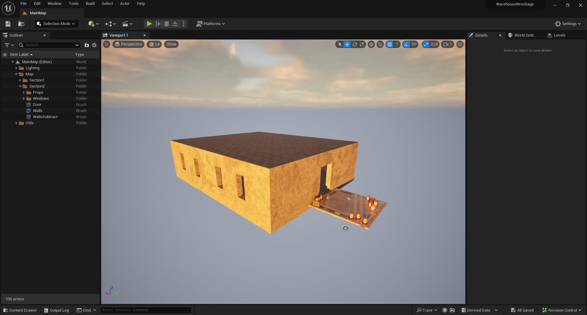
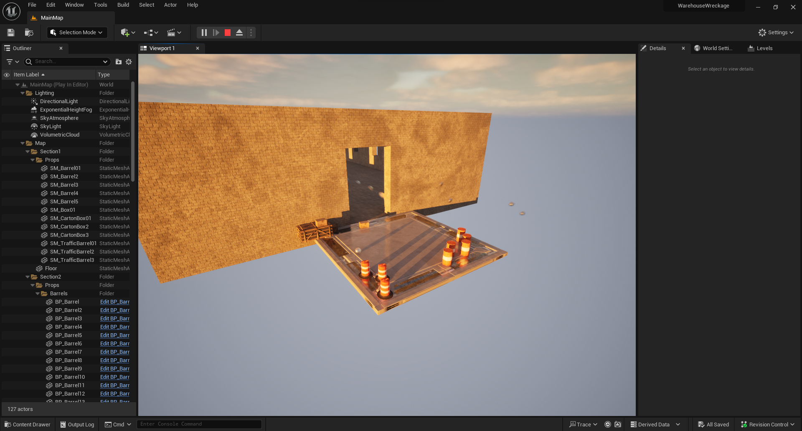
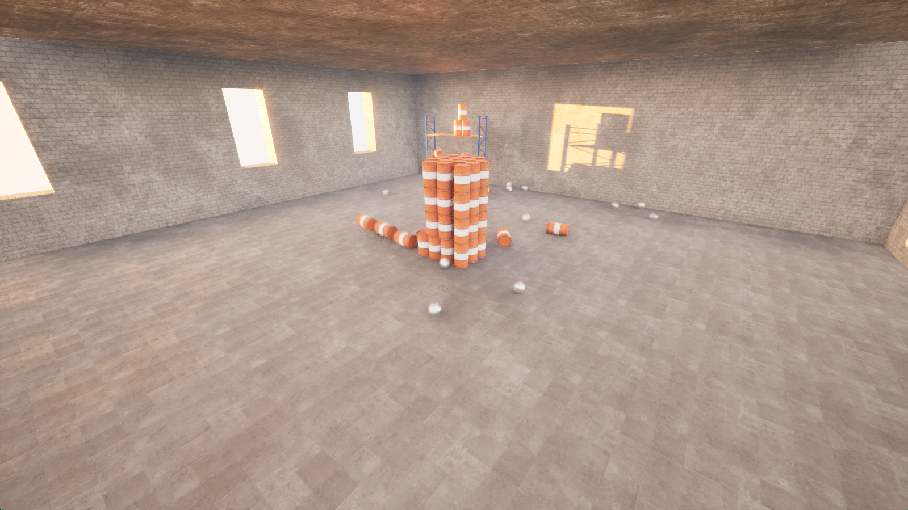

# WarehouseWreckage

## Overview
WarehouseWreckage is a 3D flying shooter game, the objective is to empty your stock of ammos by firing on items in the world.
> Made in one evening (Thanks to the formation of Sam Pattuzzi at https://www.gamedev.tv/p/unreal-5-0-c-developer-learn-c-and-make-video-games)

## Table of Contents
- [Features](#features)
- [Technologies Used](#technologies-used)
- [Demo](#demo)
- [License](#license)

## Features
- **3D Flying Shooter Game**: Immerse yourself in a 3D world where you can fly and shoot projectiles to interact with various items. Enjoy the freedom of movement and thrilling action as you navigate through the level.

- **Custom Mesh Collision**: Implement custom mesh collision systems to enhance the realism and precision of interactions within the game world. Stack items without them falling, adding depth and immersion to your gaming experience.

## Technologies Used

- **UE5**: UE5 is a powerful and versatile game development engine known for its cutting-edge graphics, realistic physics, and robust game creation tools. It provides an immersive environment for developers to bring their visions to life.

- **Blueprints**: Visual scripting system simplifying game development, enabling rapid prototyping and collaboration.

## Demo

## License

This project is licensed under the MIT License - see the [LICENSE.md](LICENSE.md) file for details.